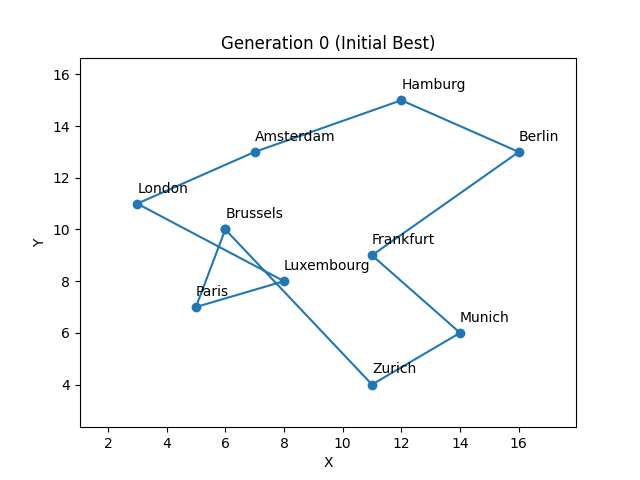
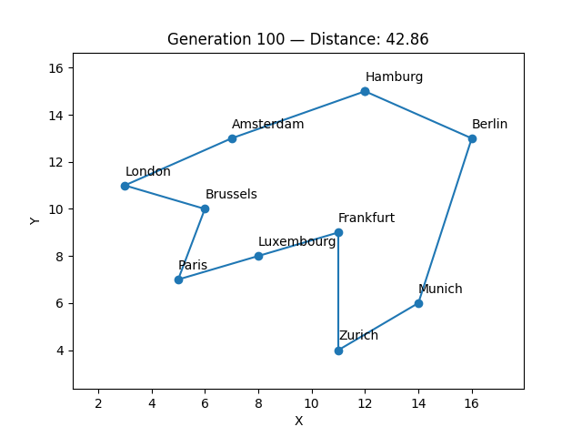

# Genetic Algorithms

A Genetic Algorithm (GA) is a search technique inspired by natural selection. It evolves a population of candidate solutions over multiple generations using three core operations:

- **Selection** — keep the fittest individuals as parents
- **Crossover** — combine two parents to produce children
- **Mutation** — randomly alter a child to maintain diversity

Each generation the population is replaced by the children of the fittest parents, gradually converging toward an optimal solution.

---

## Files

### [`maximise_a_func.py`](./maximise_a_func.py) — Integer domain (binary encoding)

Finds the integer `x` in range `[0, 31]` that maximises `f(x) = x²`.

- Individuals are represented as **5-bit binary chromosomes** (e.g. `[1,0,1,1,0]` → `x = 22`)
- **Selection:** top 4 fittest individuals kept (elitism)
- **Crossover:** single-point bit-splice between two parent chromosomes
- **Mutation:** random bit-flip at a 10% rate
- Population size: 10, Generations: 20
- Expected best: `x = 31`, `f(31) = 961`

### [`maximise_a_func2.py`](./maximise_a_func2.py) — Real-valued domain

Finds the real-valued `x` in range `[-10.0, 10.0]` that maximises `f(x) = x² + 10sin(x)`.

- Individuals are represented as **floating-point values**
- **Selection:** top 6 fittest individuals kept (elitism)
- **Crossover:** BLX-α (Blend Crossover, α=0.5) — children are sampled from a range slightly wider than the interval between the two parents, encouraging exploration
- **Mutation:** Gaussian noise (`N(0,1)`) added at a 1% rate
- Population size: 10, Generations: 20
- Expected best: around `x ≈ -9.0` where `f(x) ≈ 90.56`

### [`travelling_salesman.py`](./travelling_salesman.py) — Combinatorial domain (Travelling Salesman Problem)

Finds the shortest route that visits all 10 European cities exactly once and returns to the start — a classic NP-hard combinatorial optimisation problem.

- Cities are represented as `City` objects with `(x, y)` coordinates on a 2D grid (units are arbitrary distance units, not real-world km):

  | City | x | y |
  |------|---|---|
  | London | 3 | 11 |
  | Paris | 5 | 7 |
  | Brussels | 6 | 10 |
  | Luxembourg | 8 | 8 |
  | Amsterdam | 7 | 13 |
  | Hamburg | 12 | 15 |
  | Frankfurt | 11 | 9 |
  | Berlin | 16 | 13 |
  | Munich | 14 | 6 |
  | Zurich | 11 | 4 |
- Each individual is a **permutation** of all 10 cities (a candidate route)
- **Fitness:** `1 / total_route_distance` — shorter routes score higher
- **Distance:** Euclidean distance `√((x₂-x₁)² + (y₂-y₁)²)` summed across all consecutive city pairs, including the return leg back to the start
- **Selection:** top 10 fittest routes kept (elitism)
- **Crossover:** Ordered Crossover (OX) — a random-length segment is copied from parent 1, then remaining cities are filled in the order they appear in parent 2, preserving relative order without introducing duplicates
- **Mutation:** Swap Mutation at a 15% rate — two randomly chosen cities in the route swap positions, maintaining a valid permutation
- Population size: 50, Generations: 100
- Best found: `Luxembourg → Frankfurt → Zurich → Munich → Berlin → Hamburg → Amsterdam → London → Brussels → Paris → Luxembourg` with a distance of `≈ 42.86` units

**Initial best route (Generation 0):**

**Best route after 100 generations:**

---

Date: 10-09-2026

Obadiah Azimeh Nasara
